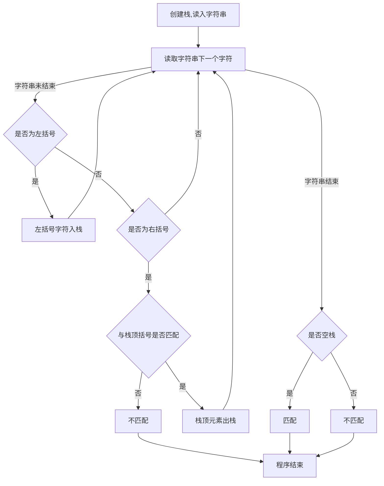

```mermaid
graph TD
    start[创建栈,读入字符串]-->condition0[读取字符串下一个字符]
    condition0--字符串未结束-->if1{是否为左括号}
    if1--是-->condition1[左括号字符入栈]
    if1--否-->if2{是否为右括号}
    if2--否-->condition0
    if2--是-->if3{与栈顶括号是否匹配}
    if3--否-->final1[不匹配]
    if3--是-->condition2[栈顶元素出栈]
    condition1-->condition0
    condition2-->condition0
    condition0--字符串结束-->if4{是否空栈}
    if4--是-->final2[匹配]
    if4--否-->final3[不匹配]
    final1-->final[程序结束]
    final2-->final
    final3-->final
```